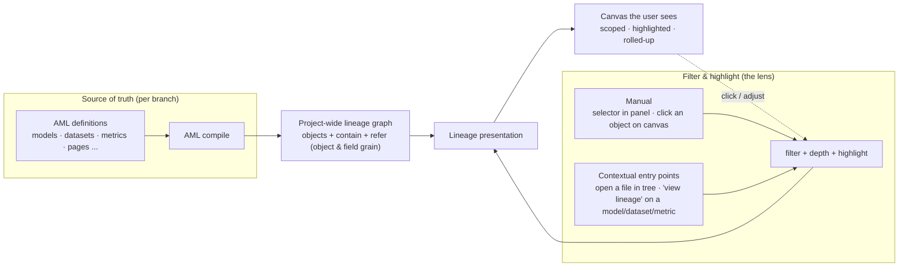

---
title: Meridian Goods business context pack
slug: meridian-goods-business-context
version: 1.2.0
last_updated: 2026-07-29
update_cadence: quarterly
doc_type: business-context
industry: ecommerce
company: Meridian Goods
business_model:
  - b2c-dtc
  - marketplace-channel
  - subscription-addon
audience:
  - ai-agent
  - analyst
  - new-hire
language: en
data_sources:
  - orders
  - order_items
  - products
  - users
  - sessions
  - refunds
  - campaigns
  - subscriptions
  - marketing_spend
entities:
  - customer
  - order
  - order_item
  - product
  - session
  - campaign
  - subscription
  - refund
metrics_defined:
  - gmv
  - net_revenue
  - aov
  - conversion_rate
  - repeat_purchase_rate
  - refund_rate
  - cac
  - subscription_mrr
glossary_terms:
  - active customer
  - revenue
  - conversion
  - completed order
  - churn
  - cohort
  - contribution margin
  - blended vs paid CAC
ambiguous_terms:
  - active customer
  - revenue
  - conversion
id_mappings: true
fiscal_calendar: calendar year, weeks start Monday
currency: USD
timezone: America/New_York
tags:
  - context-pack
  - sample
  - agentic-analytics
confidence: authoritative
precedence: this document overrides warehouse table comments and column descriptions on conflict
example dashboard: "[](/dashboards/homestay_overview.page.aml)"
---

# Meridian Goods business context

This document is the authoritative business context for analytics at Meridian Goods. It is written primarily for an AI agent answering analytical questions against the company warehouse.

```
import type * as PageTree from 'fumadocs-core/page-tree';

const tree: PageTree.Root = {
  // props
};

```

## How to use this document

- **Precedence:** definitions in this document override warehouse table comments, dbt descriptions, and any inference from column names. If this document and the schema disagree, this document wins; flag the conflict in your answer.
- **Ambiguity:** the terms listed under `ambiguous_terms` in the frontmatter each have more than one sanctioned meaning. Never pick one silently. Ask the user which meaning they intend, or state your chosen meaning explicitly at the top of the answer.
- **Coverage gaps:** if a question needs a definition this document does not contain, say so and propose a definition rather than presenting a guess as established.
- **Exclusion rules always apply:** test accounts and cancelled orders (see Business rules) are excluded from every metric unless the user explicitly asks to include them.

## Company overview

Meridian Goods is a direct-to-consumer brand selling home and kitchen goods (cookware, storage, small textiles). Founded 2019, headquartered in Brooklyn, NY. Roughly 40 employees, low-eight-figure annual revenue.

Sales channels:

- **Web store** (`channel = 'web'`) - the primary channel, about 70% of order volume.
- **Mobile app** (`channel = 'app'`) - launched March 2024, about 20% of order volume.
- **Marketplace** (`channel = 'mkt'`) - a curated storefront on a third-party marketplace, about 10% of order volume. Marketplace orders arrive via nightly import and have no session data.

## Business model and revenue streams

Meridian has three revenue streams. This is why the bare word "revenue" is ambiguous here (see Ambiguous terms):

1. **Product sales** - one-off purchases of physical goods. The dominant stream.
2. **Shipping fees** - charged on orders under the free-shipping threshold ($75). Recorded in `orders.shipping_fee`, never in `order_items`.
3. **Meridian Plus subscription** - a $9.99/month membership (free shipping, early access). Small but growing. Lives entirely in the `subscriptions` table; subscription charges never appear in `orders`.

## Entity definitions

### Customer

A row in `users`. A customer is anyone with an account, whether or not they have purchased. Key columns: `users.id`, `users.created_at` (account creation, not first purchase), `users.is_staff` (test/staff flag, see Business rules).

### Order

A row in `orders`, one checkout event. Status flow:

`pending` -> `paid` -> `fulfilled` -> `delivered`, with `cancelled` reachable from `pending` or `paid`.

- A **completed order** means `status IN ('paid', 'fulfilled', 'delivered')`. This is the sanctioned definition; do not use `delivered` alone.
- `cancelled` orders are excluded from all metrics by default.
- `orders.total_amount` = item subtotal + shipping fee - discounts, pre-refund. Refunds are never netted into this column.

### Order item

A row in `order_items`, one product line within an order. `order_items.unit_price` is the price actually paid after item-level discounts; `products.list_price` is the catalog price. Use `unit_price` for revenue math.

### Product

A row in `products`. `products.category` is one of: `cookware`, `storage`, `textiles`, `gift-card`. Gift cards are excluded from GMV and net revenue (they are a liability at sale; revenue is recognized on redemption, which appears as a discounted order).

### Session

A row in `sessions`, one visit to the web store or app. Marketplace has no sessions. `sessions.converted_order_id` links a session to the order placed in it, if any.

### Campaign

A row in `campaigns` (marketing campaigns). Orders attribute to campaigns via `orders.campaign_id`, last-touch. Internal campaign nicknames are not stored in the warehouse; see ID mappings below.

### Subscription

A row in `subscriptions`, one Meridian Plus membership. `status IN ('active', 'past_due', 'cancelled')`. `past_due` counts as active for MRR until 30 days past due.

### Refund

A row in `refunds`, linked to an order via `refunds.order_id`. Partial refunds are common; sum `refunds.amount` per order rather than assuming full-order refunds.

## Metric definitions

All metrics exclude test accounts and cancelled orders (see Business rules) and are in USD.

### GMV (gross merchandise value)

- **Definition:** total value of completed orders before refunds, excluding shipping fees and gift-card purchases.
- **Formula:** `SUM(order_items.quantity * order_items.unit_price)` over completed orders, where `products.category != 'gift-card'`.
- **Grain:** daily, by order date (`orders.created_at`).
- **Owner:** finance (An Pham).

### Net revenue

- **Definition:** GMV plus shipping fees, minus refunds. Does **not** include subscription revenue.
- **Formula:** GMV + `SUM(orders.shipping_fee)` over completed orders - `SUM(refunds.amount)` by refund date.
- **Note:** refunds are dated by `refunds.created_at`, not the original order date, so net revenue for a closed month can still move.
- **Owner:** finance (An Pham).

### Subscription MRR

- **Definition:** monthly recurring revenue from Meridian Plus.
- **Formula:** `COUNT(*) * 9.99` over `subscriptions` where `status = 'active'`, or `status = 'past_due'` and fewer than 30 days past due, as of month end.
- **Owner:** growth (Riley Chen).

### AOV (average order value)

- **Definition:** average `orders.total_amount` per completed order. Includes shipping fees (deliberate: finance wants AOV to match what customers were charged).
- **Formula:** `SUM(orders.total_amount) / COUNT(orders.id)` over completed orders.

### Conversion rate

Ambiguous; see Ambiguous terms. The default when the user does not specify is the **session-based** definition:

- **Formula:** sessions with `converted_order_id IS NOT NULL` / all sessions, web and app only (marketplace has no sessions).

### Repeat purchase rate

- **Definition:** share of customers with 2 or more lifetime completed orders, among customers with at least 1 completed order.
- **Grain:** point-in-time snapshot; when trended, compute per acquisition-month cohort.

### Refund rate

- **Definition:** refunded amount as a share of net revenue before refunds.
- **Formula:** `SUM(refunds.amount) / (GMV + shipping fees)` for the same period, refunds dated by `refunds.created_at`.
- **Healthy range:** 2-4%. Above 5% in a month warrants investigation.

### CAC (customer acquisition cost)

- **Definition:** marketing spend divided by new customers acquired (first completed order in the period).
- **Formula:** `SUM(marketing_spend.amount) / COUNT(DISTINCT first-time purchasers)`.
- **Two variants:** *paid CAC* uses only `marketing_spend.channel_type = 'paid'`; *blended CAC* uses all spend. Default to blended and say so.

### Metrics mentioned but not formally defined

The growth team also talks about **"repeat revenue share"** - the portion of net revenue coming from returning customers (customers whose first completed order predates the period). No governed definition exists yet. If asked, derive it from net revenue and first-order dates, present the derivation explicitly, and note it is not a governed metric.

## Ambiguous terms - always confirm before answering

### "Active customer"

Two sanctioned meanings:

1. **Commerce definition (finance, default for revenue contexts):** a customer with at least one completed order in the trailing 90 days.
2. **Engagement definition (product team):** a customer with at least one session in the trailing 30 days, purchase or not.

These differ by roughly 3x (engagement is the larger number). Confirm with the user which one they mean; if forced to default, use the commerce definition and label it.

### "Revenue"

Could mean: **GMV**, **net revenue**, or **net revenue + subscription MRR** (finance calls the last one "total revenue" in board decks). Default to **net revenue** for ad-hoc questions and state the choice. Never silently include subscription revenue in a product-sales question or vice versa.

### "Conversion"

1. **Session conversion** (default): converting sessions / all sessions.
2. **Visitor conversion:** converting distinct users / distinct users with a session in the period. Used by the growth team for weekly reviews.

Marketplace orders are excluded from both, since they have no sessions.

## ID mappings not present in the warehouse

These names appear in meetings and docs but only the IDs exist in the warehouse. Translate before querying.

### Campaign nicknames

| Nickname used by the team | `campaigns.id` |
| --- | --- |
| Summer Splash | 4172 |
| Project Lighthouse (Q1 brand push) | 4088 |
| Holiday 2025 | 3951 |
| App Launch promo | 4010 |

### Channel codes

| `orders.channel` | Meaning |
| --- | --- |
| `web` | Web store |
| `app` | Mobile app (iOS + Android combined) |
| `mkt` | Third-party marketplace storefront |

### Warehouse-internal enums

| `marketing_spend.channel_type` | Meaning |
| --- | --- |
| `paid` | Paid ads (search, social, affiliates) |
| `owned` | Email, SMS, organic content |
| `brand` | Sponsorships, PR, events |

## Business rules and data gotchas

- **Test accounts:** exclude `users.is_staff = true` and any email ending in `@meridiangoods.com` from every metric. This filter is mandatory, not optional.
- **Timezone:** all warehouse timestamps are UTC. Business reporting is in America/New_York; convert before bucketing by day. A "day" boundary mistake shifts roughly 4% of orders.
- **Fiscal calendar:** calendar year; weeks start Monday. "Last week" means the most recent complete Monday-Sunday week.
- **Channel backfill gap:** orders before 2024-01-01 have `channel IS NULL`. Treat null channel on pre-2024 orders as `web` (confirmed by finance); flag this assumption when it materially affects an answer.
- **Marketplace import lag:** `mkt` orders arrive via a nightly import, so "today" always undercounts marketplace. Avoid same-day comparisons that include marketplace.
- **Gift cards:** excluded from GMV and net revenue at purchase time (see Product entity). Redemptions show up as order discounts.
- **Seasonality:** November-December contribute roughly 30% of annual GMV. A January drop versus December is expected; compare year over year for those months.

## Canonical questions and the sanctioned approach

**"What was revenue last month?"**
Confirm which revenue (default: net revenue, stated). Completed orders only, GMV + shipping - refunds, refunds by refund date, exclude test accounts and gift cards, dates in America/New_York.

**"How many active customers do we have?"**
Ask commerce vs engagement definition first. Then apply the exact trailing-window definition and state the as-of date.

**"How did Project Lighthouse perform?"**
Resolve the nickname to `campaign_id = 4088` (this document is the only place that mapping exists). Report completed orders, GMV, and net revenue attributed last-touch via `orders.campaign_id`; note attribution is last-touch.

**"What's our conversion rate on the app?"**
Session conversion by default: converting sessions / all sessions where `sessions.channel = 'app'`. Note marketplace exclusion is irrelevant here but state the definition used.


[Dashboard homestay](/dashboards/homestay_overview.page.aml)

[Beer dataset](/3.%20Archive/beer.dataset.aml)

